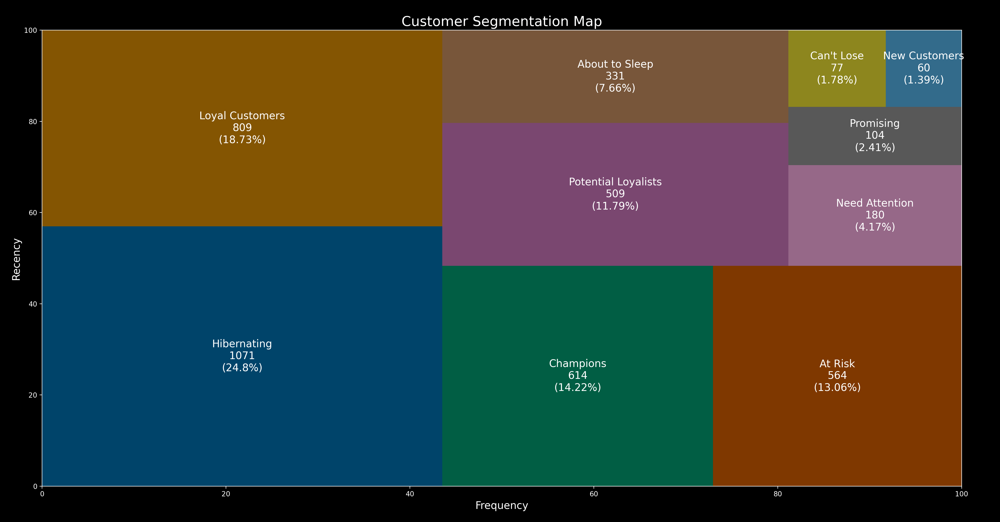

## E-Commerce Marketing Strategy Challenge

## 🌐 Overview
The project demonstrates how this customer relationship analytics framework can turn sales and customer service data into insights for smarter business decision-making process. It enhances sales, customer service, and marketing by:
- **Validating Customer Data**: Pinpoint insights for targeted marketing, ensuring the marketing strategy reach the right audience.
- **Understanding Customer Behavior**: Learn spending patterns and preferences to tailor marketing efforts.
- **Boosting Lead Generation**: Identify which marketing tactics drive sales and apply them more broadly to potentially increase revenue.

This simple combination of RFM clustering model with data transformation identify high-value customers, developing retention strategies, and optimizing marketing efforts to increase customer loyalty and revenue.

This dataset includes all transactions occurring between 2010 and 2011 from a UK-based retailer available at the [UCI Machine Learning Repository](https://archive.ics.uci.edu/dataset/352/online+retail).

<!-- ## 🌟 Problem -->

## 🌟 Result Summary

## 🎯 Objectives
The objectives of the project are as follows:

* **Data Cleaning & Transformation**: We clean up by handling missing values, duplicates, and outliers for future modeling process.
* **Feature Engineering**: Develop customer-centric features, setting the stage for customer segmentation.
* **RFM Segmentation & K-Means Clustering**: Segment customers into distinct groups using K-means and RFM models, facilitating targeted marketing.
* **Cluster Analysis & Evaluation Metrics**: Dive into the story of each cluster to understand customer's shopping behaviors, then develop optimized targeted marketing strategies.

<!-- ## 📁 File Descriptions

<!-- ## 🚀 How to run

<!-- - 🤝 **Connect on LinkedIn**: Looking for collaborations? Feel free to connect on [LinkedIn](https://linkedin.com/in/trungdoquoc/). -->